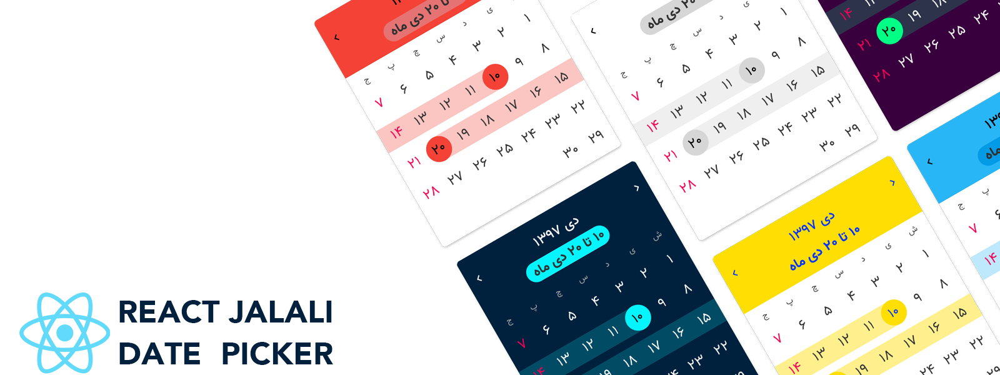

# Jalali React Date-Picker

[](https://travis-ci.org/rzkhosroshahi/react-jalali-datepicker)
[](#contributors)

🚨 I start to redesigning this package. [Here](https://www.figma.com/file/tuXbhHlGs8eQpL1l0NAHHe/Calender?node-id=0%3A1) you can see the new artboards that well designed by [eanlami](https://dribbble.com/eanlami). If you want to collabrate for this version feel free to make changes or [contact me](rzkhosroshahi@gmail.com) 😊



React component that helps you to makes simple Farsi/Jalali/Shamsi date picker. It also has range date picker you can select multiple days in multiple months.

## Installation

`$ npm install -S jalali-react-datepicker`

## Date Picker

| props               | type                        | default                                                                                                                                                 |
| ------------------- | --------------------------- | ------------------------------------------------------------------------------------------------------------------------------------------------------- |
| gregorian           | boolean                     | false                                                                                                                                                   |
| modal               | boolean                     | false. If set to true, date picker will be opened in modal.                                                                                             |
| value               | timestamp Or Date Or Moment | Date Moment today date                                                                                                                                  |
| weekend             | number[]                    | `[6]` for jalali and `[0, 6]` for gregorian                                                                                                             |
| ArrowLeft           | React.ReactType             | default component                                                                                                                                       |
| ArrowLeft           | React.ReactType             | default component                                                                                                                                       |
| submittable         | boolean                     | false. if it is true rangeDatePicker show submit and cancel                                                                                             |
| ClockIcon           | React.ReactType             | default component                                                                                                                                       |
| DateIcon            | React.ReactType             | default component                                                                                                                                       |
| timePicker          | boolean                     | true.                                                                                                                                                   |
| onClickSubmitButton | function                    | null. if you passed this will be something like [this](https://github.com/rzkhosroshahi/react-jalali-datepicker/tree/submit-button#onClickSubmitButton) |
| onDateChange        | function                    | null. if you passed this will be something like [this](https://github.com/rzkhosroshahi/react-jalali-datepicker/tree/submit-button#onClickSubmitButton) |
| modalZIndex         | number                      | 9999                                                                                                                                                    |
| theme               | object                      | default theme you can see [here](https://github.com/rzkhosroshahi/react-jalali-datepicker/blob/master/src/theme.ts)                                     |
| label               | string                      | default is null                                                                                                                                         |
| open                | boolean                     | default is false. control opening and close modal from outside                                                                                          |
| onToggle            | function                    | default is undefined. this function will be called when the modal open and close state is changed                                                       |

## usage

```jsx
import React from "react";
import { render } from "react-dom";
import { DatePicker } from "jalali-react-datepicker";

render(<DatePicker />, document.getElementById("root"));
```

### onClickSubmitButton

You can access to datePicker value when submit button is clicked.

example:

```javascript
function submitExample({ value }) {
  console.log("value ", value);
}
```

### onDateChange

You can access to datePicker value when date is changed.

example:

```javascript
function dateChangeExample({ value }) {
  console.log("value ", value);
}
```

## Calender

| props                  | type                        | default                                                                                                                                                 |
| ---------------------- | --------------------------- | ------------------------------------------------------------------------------------------------------------------------------------------------------- |
| gregorian              | boolean                     | false                                                                                                                                                   |
| value                  | timestamp Or Date Or Moment |
| Date Moment today date |
| weekend                | number[]                    | `[6]` for jalali and `[0, 6]` for gregorian                                                                                                             |
| ArrowLeft              | React.ReactType             | default component                                                                                                                                       |
| ArrowLeft              | React.ReactType             | default component                                                                                                                                       |
| submittable            | boolean                     | false. if it is true rangeDatePicker show submit and cancel                                                                                             |
| ClockIcon              | React.ReactType             | default component                                                                                                                                       |
| DateIcon               | React.ReactType             | default component                                                                                                                                       |
| timePicker             | boolean                     | true.                                                                                                                                                   |
| onClickSubmitButton    | function                    | null. if you passed this will be something like [this](https://github.com/rzkhosroshahi/react-jalali-datepicker/tree/submit-button#onClickSubmitButton) |
| onDateChange           | function                    | null. if you passed this will be something like [this](https://github.com/rzkhosroshahi/react-jalali-datepicker/tree/submit-button#onClickSubmitButton) |
| modalZIndex            | number                      | 9999                                                                                                                                                    |
| theme                  | object                      | default theme you can see [here](https://github.com/rzkhosroshahi/react-jalali-datepicker/blob/master/src/theme.ts)                                     |
| label                  | string                      | default is null                                                                                                                                         |
| open                   | boolean                     | default is false. control opening and close modal from outside                                                                                          |
| onToggle               | function                    | default is undefined. this function will be called when the modal open and close state is changed                                                       |

## usage

```jsx
import React from "react";
import { render } from "react-dom";
import { Calender } from "jalali-react-datepicker";

render(<Calender />, document.getElementById("root"));
```

### onClickSubmitButton

You can access to datePicker value when submit button is clicked.

example:

```javascript
function submitExample({ value }) {
  console.log("value ", value);
}
```

### onDateChange

You can access to datePicker value when date is changed.

example:

```javascript
function dateChangeExample({ value }) {
  console.log("value ", value);
}
```

## Range Date Picker

You can make range date picker with this component. In the below table you can see all the props you can pass to this component.

Note that all props are _optional_.

| props               | type                  | default                                                                                                                                                 |
| ------------------- | --------------------- | ------------------------------------------------------------------------------------------------------------------------------------------------------- |
| gregorian           | boolean               | false                                                                                                                                                   |
| modal               | boolean               | false. If set to true, date picker will be opened in modal.                                                                                             |
| start               | string. ex: 1397/5/18 | today date                                                                                                                                              |
| end                 | string. ex: 1397/5/18 | today date                                                                                                                                              |
| weekend             | number[]              | `[6]` for jalali and `[0, 6]` for gregorian                                                                                                             |
| ArrowLeft           | React.ReactType       | default component                                                                                                                                       |
| ArrowRight          | React.ReactType       | default component                                                                                                                                       |
| submittable         | boolean               | false. if it is true rangeDatePicker show submit and cancel buttons                                                                                     |
| onClickSubmitButton | function              | null. if you passed this will be something like [this](https://github.com/rzkhosroshahi/react-jalali-datepicker/tree/submit-button#onClickSubmitButton) |
| onDateChange        | function              | null. if you passed this will be something like [this](https://github.com/rzkhosroshahi/react-jalali-datepicker/tree/submit-button#onClickSubmitButton) |
| modalZIndex         | number                | 9999                                                                                                                                                    |
| theme               | object                | default theme you can see [here](https://github.com/rzkhosroshahi/react-jalali-datepicker/blob/master/src/theme.ts)                                     |
| fromLabel           | string                | default is از تاریخ                                                                                                                                     |
| toLabel             | string                | default is تا تاریخ                                                                                                                                     |
| open                | boolean               | default is false. control opening and close modal from outside                                                                                          |
| onToggle            | function              | default is undefined. this function will be called when the modal open and close state is changed                                                       |

## usage

```jsx
import React from "react";
import { render } from "react-dom";
import { RangeDatePicker } from "jalali-react-datepicker";

render(<RangeDatePicker />, document.getElementById("root"));
```

### onClickSubmitButton

You can access to start and end date when submit button is clicked.

example:

```javascript
function submitExample({ start, end }) {
  console.log("start ", start);
  console.log("end ", end);
}
```

### onDateChange

You can access to datePicker value when date is changed.

example:

```javascript
function dateChangeExample({ value }) {
  console.log("value ", value);
}
```

## Range Calender

You can make range date picker with this component. In the below table you can see all the props you can pass to this component.

Note that all props are _optional_.

| props               | type                  | default                                                                                                                                                 |
| ------------------- | --------------------- | ------------------------------------------------------------------------------------------------------------------------------------------------------- |
| gregorian           | boolean               | false                                                                                                                                                   |
| start               | string. ex: 1397/5/18 | today date                                                                                                                                              |
| end                 | string. ex: 1397/5/18 | today date                                                                                                                                              |
| weekend             | number[]              | `[6]`                                                                                                                                                   |
| ArrowLeft           | React.ReactType       | default component                                                                                                                                       |
| ArrowRight          | React.ReactType       | default component                                                                                                                                       |
| submittable         | boolean               | false. if it is true rangeDatePicker show submit and cancel buttons                                                                                     |
| onClickSubmitButton | function              | null. if you passed this will be something like [this](https://github.com/rzkhosroshahi/react-jalali-datepicker/tree/submit-button#onClickSubmitButton) |
| onDateChange        | function              | null. if you passed this will be something like [this](https://github.com/rzkhosroshahi/react-jalali-datepicker/tree/submit-button#onClickSubmitButton) |
| modalZIndex         | number                | 9999                                                                                                                                                    |
| theme               | object                | default theme you can see [here](https://github.com/rzkhosroshahi/react-jalali-datepicker/blob/master/src/theme.ts)                                     |
| fromLabel           | string                | default is از تاریخ                                                                                                                                     |
| toLabel             | string                | default is تا تاریخ                                                                                                                                     |
| open                | boolean               | default is false. control opening and close modal from outside                                                                                          |
| onToggle            | function              | default is undefined. this function will be called when the modal open and close state is changed                                                       |

## usage

```jsx
import React from "react";
import { render } from "react-dom";
import { RangeCalender } from "jalali-react-datepicker";

render(<RangeCalender />, document.getElementById("root"));
```

### onClickSubmitButton

You can access to start and end date when submit button is clicked.

example:

```javascript
function submitExample({ start, end }) {
  console.log("start ", start);
  console.log("end ", end);
}
```

### onDateChange

You can access to datePicker value when date is changed.

example:

```javascript
function dateChangeExample({ value }) {
  console.log("value ", value);
}
```

## Range Calender Vertical

You can make range date picker with this component. In the below table you can see all the props you can pass to this component.

Note that all props are _optional_.

| props               | type                    | default                                                                                                                                                 |
| ------------------- | ----------------------- | ------------------------------------------------------------------------------------------------------------------------------------------------------- |
| gregorian           | boolean                 | false                                                                                                                                                   |
| hasHead             | boolean                 | true                                                                                                                                                    |
| inputDate           | string or moment.Moment | today                                                                                                                                                   |
| start               | string. ex: 1397/5/18   | today date                                                                                                                                              |
| end                 | string. ex: 1397/5/18   | today date                                                                                                                                              |
| weekend             | number[]                | `[6]`                                                                                                                                                   |
| ArrowLeft           | React.ReactType         | default component                                                                                                                                       |
| ArrowRight          | React.ReactType         | default component                                                                                                                                       |
| submittable         | boolean                 | false. if it is true rangeDatePicker show submit and cancel buttons                                                                                     |
| onClickSubmitButton | function                | null. if you passed this will be something like [this](https://github.com/rzkhosroshahi/react-jalali-datepicker/tree/submit-button#onClickSubmitButton) |
| onDateChange        | function                | null. if you passed this will be something like [this](https://github.com/rzkhosroshahi/react-jalali-datepicker/tree/submit-button#onClickSubmitButton) |
| modalZIndex         | number                  | 9999                                                                                                                                                    |
| theme               | object                  | default theme you can see [here](https://github.com/rzkhosroshahi/react-jalali-datepicker/blob/master/src/theme.ts)                                     |
| fromLabel           | string                  | default is از تاریخ                                                                                                                                     |
| toLabel             | string                  | default is تا تاریخ                                                                                                                                     |
| open                | boolean                 | default is false. control opening and close modal from outside                                                                                          |
| onToggle            | function                | default is undefined. this function will be called when the modal open and close state is changed                                                       |

## usage

```jsx
import React from "react";
import { render } from "react-dom";
import { RangeCalenderVertical } from "jalali-react-datepicker";

render(<RangeCalenderVertical />, document.getElementById("root"));
```

### onClickSubmitButton

You can access to start and end date when submit button is clicked.

example:

```javascript
function submitExample({ start, end }) {
  console.log("start ", start);
  console.log("end ", end);
}
```

### onDateChange

You can access to datePicker value when date is changed.

example:

```javascript
function dateChangeExample({ value }) {
  console.log("value ", value);
}
```

## ToDo

- ~~write DatePicker~~
- ~~add label to inputs~~
- create codesandbox page for preview
- ~~add TimePicker~~

## Contributors

Thanks goes to these wonderful people ([emoji key](https://github.com/kentcdodds/all-contributors#emoji-key)):

<!-- ALL-CONTRIBUTORS-LIST:START - Do not remove or modify this section -->
<!-- prettier-ignore -->
| [<br /><sub><b>Reza Khosroshahi</b></sub>](https://reza.blue)<br />[💻](https://github.com/rzkhosroshahi/react-jalali-datepicker/commits?author=rzkhosroshahi "Code") [📖](https://github.com/rzkhosroshahi/react-jalali-datepicker/commits?author=rzkhosroshahi "Documentation") [💡](#example-rzkhosroshahi "Examples") [🤔](#ideas-rzkhosroshahi "Ideas, Planning, & Feedback") [⚠️](https://github.com/rzkhosroshahi/react-jalali-datepicker/commits?author=rzkhosroshahi "Tests") | [<br /><sub><b>saeedjalali</b></sub>](http://saeedjalali.ir)<br />[💬](#question-saeedjalali1 "Answering Questions") [🐛](https://github.com/rzkhosroshahi/react-jalali-datepicker/issues?q=author%3Asaeedjalali1 "Bug reports") [💻](https://github.com/rzkhosroshahi/react-jalali-datepicker/commits?author=saeedjalali1 "Code") [🤔](#ideas-saeedjalali1 "Ideas, Planning, & Feedback") [👀](#review-saeedjalali1 "Reviewed Pull Requests") [📢](#talk-saeedjalali1 "Talks") | [<br /><sub><b>ZMashhadizadeh</b></sub>](https://github.com/ZMashhadizadeh)<br />[💻](https://github.com/rzkhosroshahi/react-jalali-datepicker/commits?author=ZMashhadizadeh "Code") [📦](#platform-ZMashhadizadeh "Packaging/porting to new platform") |
| :---: | :---: | :---: |

<!-- ALL-CONTRIBUTORS-LIST:END -->

This project follows the [all-contributors](https://github.com/kentcdodds/all-contributors) specification. Contributions of any kind welcome!

## License

[MIT License](https://github.com/rzkhosroshahi/react-jalali-datepicker/blob/datePicker/LICENSE)
